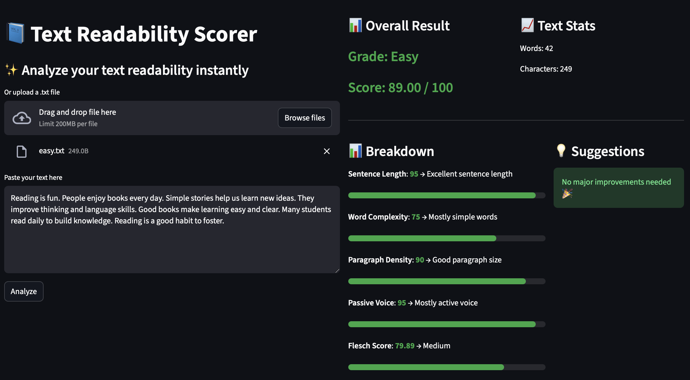
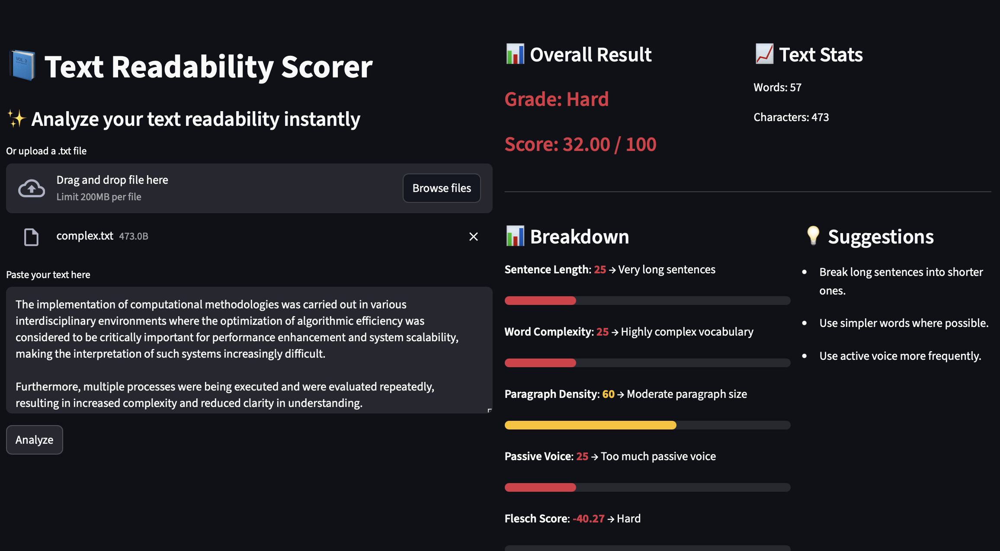
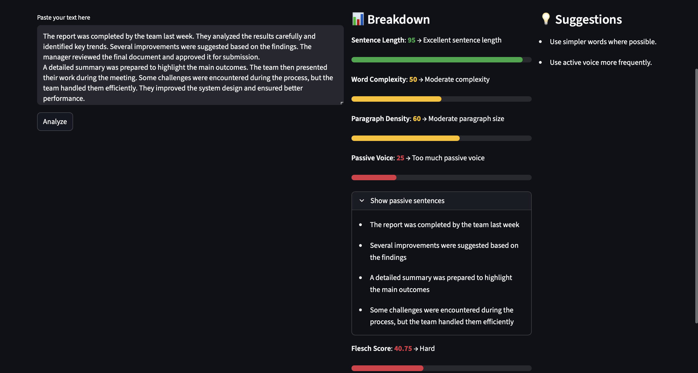

# 📘 Text Readability Scorer

## 🚀 Overview

The **Text Readability Scorer** is a Python-based web application that analyzes the readability of a given text using multiple linguistic metrics.
It provides an intuitive interface to evaluate text quality and offers actionable suggestions to improve clarity.

---

## ✨ Features

* 📥 Paste text or upload `.txt` file
* 📊 Readability scoring with multiple metrics:

  * Sentence Length Analysis
  * Word Complexity Evaluation
  * Paragraph Density Assessment
  * Passive Voice Detection
  * Flesch Reading Ease Score
* 🎨 Color-coded visual feedback:

  * 🟢 Easy (Good readability)
  * 🟡 Medium (Moderate readability)
  * 🔴 Hard (Poor readability)
* 💡 Intelligent suggestions for improvement
* 📈 Real-time text statistics (word & character count)
* 🌐 Interactive UI built using Streamlit

---

## 🧠 Methodology

The system uses a **rule-based scoring approach** combined with standard readability formulas:

* **Sentence Length** → Average words per sentence
* **Word Complexity** → Percentage of long words (>7 characters)
* **Paragraph Density** → Words per paragraph
* **Passive Voice Detection** → Regex-based pattern matching
---
## 🔍 Recent Improvement

- Enhanced passive voice detection to reduce false positives by excluding common stative adjectives
- Added sentence-level feedback by highlighting specific passive sentences in the UI

---

* **Flesch Reading Ease** → Standard readability formula

A **weighted scoring model** is applied to compute the final readability score.

---

## 📁 Project Structure

```
text-readability-analyzer/
│
├── app.py                # Streamlit UI
├── readability.py        # Core logic and scoring
├── requirements.txt      # Dependencies
├── README.md             # Documentation
│
└── sample_texts/
    ├── easy.txt
    └── complex.txt
```

---

## ⚙️ Installation & Setup

### 1️⃣ Clone the repository

```bash
git clone https://github.com/<your-username>/text-readability-analyzer.git
cd text-readability-analyzer
```

### 2️⃣ Create virtual environment (recommended)

```bash
python3 -m venv .venv
source .venv/bin/activate
```

### 3️⃣ Install dependencies

```bash
pip install -r requirements.txt
```

### 4️⃣ Run the application

```bash
streamlit run app.py
```

---

## 🧪 Sample Inputs

### 🟢 Easy Text

```
Reading is fun. People enjoy books every day. Simple stories help us learn new ideas. They improve thinking and language skills. Good books make learning easy and clear. Many students read daily to build knowledge. Reading is a good habit to foster.
```

### 🔴 Complex Text

```
The implementation of computational methodologies was carried out in various interdisciplinary environments where the optimization of algorithmic efficiency was considered to be critically important for performance enhancement and system scalability, making the interpretation of such systems increasingly difficult. 

Furthermore, multiple processes were being executed and were evaluated repeatedly, resulting in increased complexity and reduced clarity in understanding.
```

---

## 📸 Screenshots

### 🟢 Easy Text Output


### 🔴 Complex Text Output


### 🔍 Passive Voice Detection with Sentence-Level Feedback


The system detects passive voice constructions using a refined rule-based approach that reduces false positives by filtering common stative expressions. It also provides sentence-level feedback by listing flagged sentences, allowing users to easily identify and improve problematic parts of their text.

---

## 🎯 Results

* Provides a **readability grade** (Easy / Medium / Hard)
* Displays **detailed metric breakdown**
* Highlights areas needing improvement
* Offers **actionable suggestions**
* Identifies **passive voice usage with sentence-level insights**

---

## 💡 Future Improvements

* 🔍 NLP-based semantic analysis
* 🤖 AI-powered readability suggestions
* 📄 Support for PDF and DOCX files
* 🌍 Multi-language support
* ☁️ Deployment for public access

---

## 🧑‍💻 Author

**Sanal Jose**
M.Tech Data Science Student

---

## 📜 License

This project is licensed under the MIT License.

---

## ⭐ Acknowledgment

This project was developed as part of an academic micro-project to demonstrate practical implementation of text analytics and user-centric application design.
